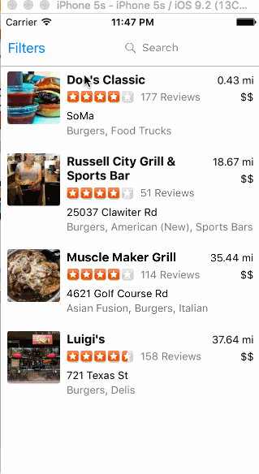

### Basic Yelp client

Working hours: 8

* [x]  Search results page
 
* [x]  Table rows should be dynamic height according to the content height.
  
* [x]  Custom cells should have the proper Auto Layout constraints.

* [x]  Search bar should be in the navigation bar (doesn't have to expand to show location like the real Yelp app does)

* [x]  Filter page. Unfortunately, not all the filters are supported in the Yelp API. 

* [ ]  The filters you should actually have are: category, sort (best match, distance, highest rated), radius (meters), deals (on/off).

Walkthrough:

 		
